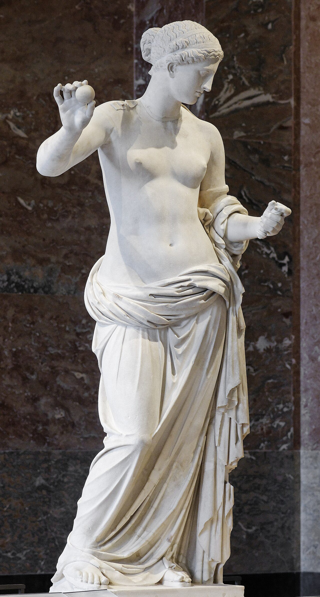

<p align="center">
  
</p>

<h1 align="center">eveseni.com</h1>

<p align="center">
  The personal site of Ève Aimée Seni — founder, tech lead, painter.<br/>
  Two portfolios in one place, laid out like a small museum.
</p>

<p align="center">
  <a href="https://eveseni.com">eveseni.com</a> ·
  <a href="https://eveseni.com/dev">/dev</a> ·
  <a href="https://eveseni.com/art">/art</a>
</p>

---

## What's on the site

| Route | Room |
|---|---|
| `/` | **Landing** — portrait, a typed line (*a startup founder · a fullstack developer · also an artist*), and two doors: Founder or Artist. |
| `/dev` | **Founder** — Aphrodite hero with the rolling *Founder / Tech Lead* word, an about block on a torn marble edge, milestones with pinned photos, projects (LOCVM front and centre), stack & skills against the Parthenon, contact. |
| `/art` | **Portfolio** — hero, a carousel of framed pieces, a prints teaser, three oils hung on a clay wall with placards, *Raison d'être*, contact. |
| `/art/prints` | **Prints & watercolours** — masonry grid, click to enlarge on desktop. |
| `/art/paintings` | **Paintings** — the oils, full size. |

Both halves share one visual language: Bodoni Moda headings, mono-caps eyebrows and nav, Poppins body, stone / warm-stone / clay bands, and a thin rule under the name.

<p align="center">
  
</p>

## Stack

- **React 19** + **React Router 7** — single-page, client-side routes
- **Vite** — dev server and build
- **Tailwind CSS 4** for layout utilities, plus hand-written CSS for the museum bits (`src/CSS/founder.css`, `src/CSS/art.css`)
- **Vitest** + Testing Library for route and mobile tests
- **react-slick** carousel, **typed.js** for the landing line, **react-icons**
- Images served from Cloudinary; a few local ones in `public/images`
- Deployed to GitHub Pages at `eveseni.com` (`CNAME` in `public/`)

## Running it

```bash
npm install
npm run dev        # http://localhost:5173
```

```bash
npm run lint       # eslint, zero warnings allowed
npm test           # vitest
npm run build      # production build into dist/
npm run deploy     # build + push dist/ to the gh-pages branch
```

## Layout

```
src/
├── App.jsx                 routes
├── Pages/
│   ├── LandingPage.jsx     /
│   ├── FounderPage.jsx     /dev
│   └── HomeArt.jsx         /art
├── Components/
│   ├── NavBarArt.jsx       art header (mirrors the founder header)
│   ├── ContactDivArt.jsx   art contact + footer
│   ├── CarousselSmall.jsx  framed-pieces carousel
│   ├── WatercolourGrid.jsx /art/prints
│   └── PaintingGallery.jsx /art/paintings
├── data/                   journey, paintings, watercolours
├── CSS/                    founder.css, art.css, gallery.css
└── test/                   routes + mobile tests
```

## A note on the artwork

Everything under `/art` is © Ève Aimée Seni. The site blocks right-click, drag and long-press save on the paintings and prints — within reason; please don't reproduce them.
